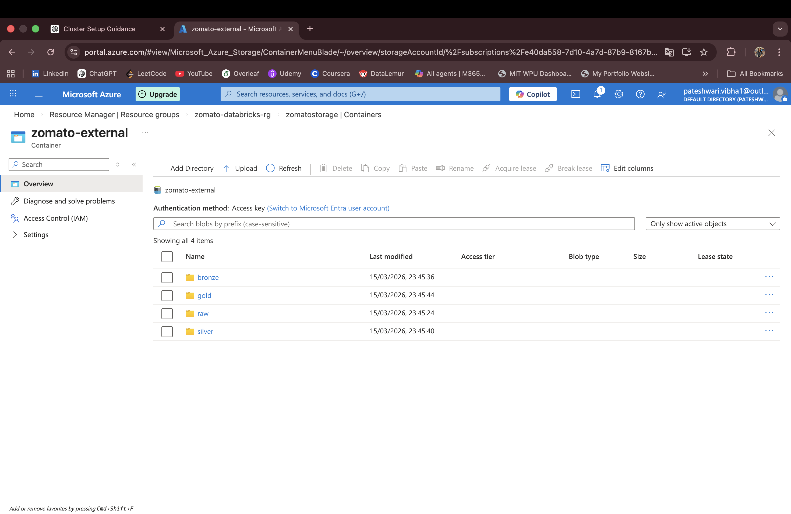
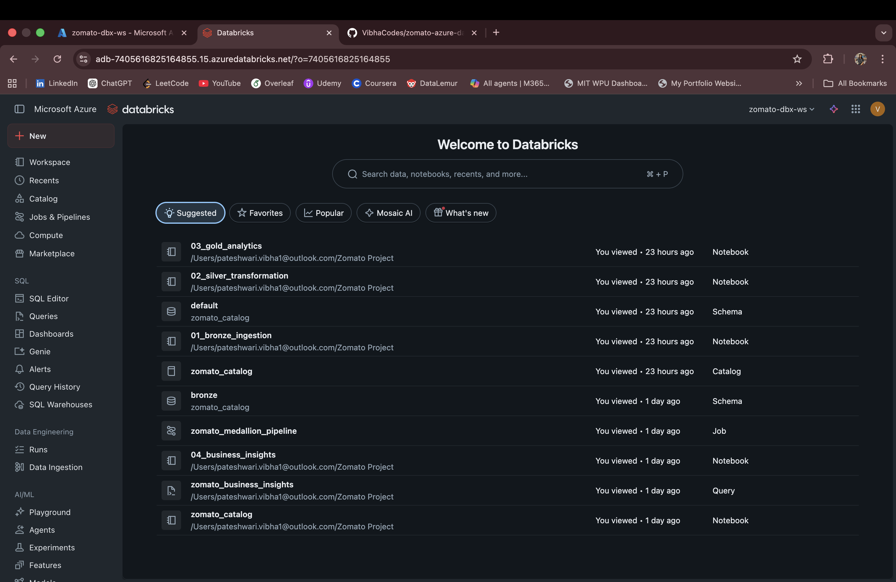
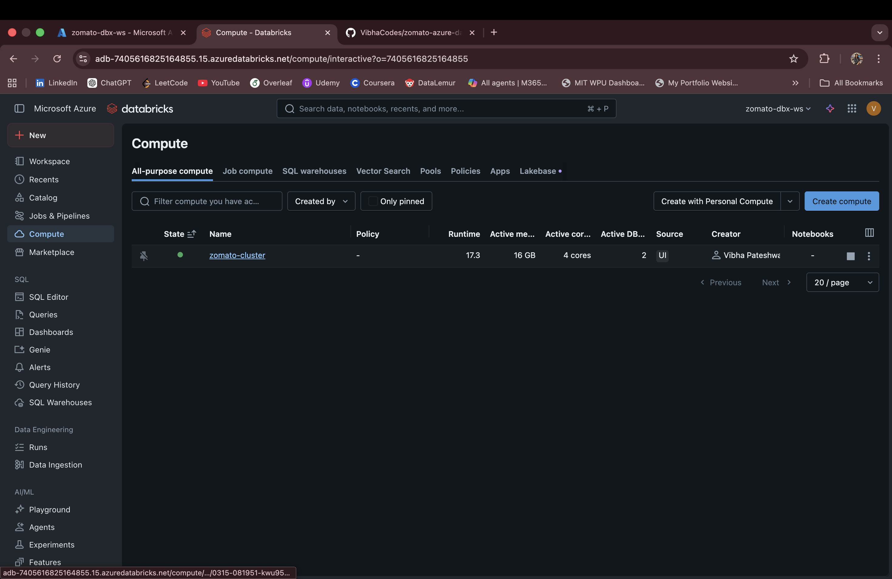
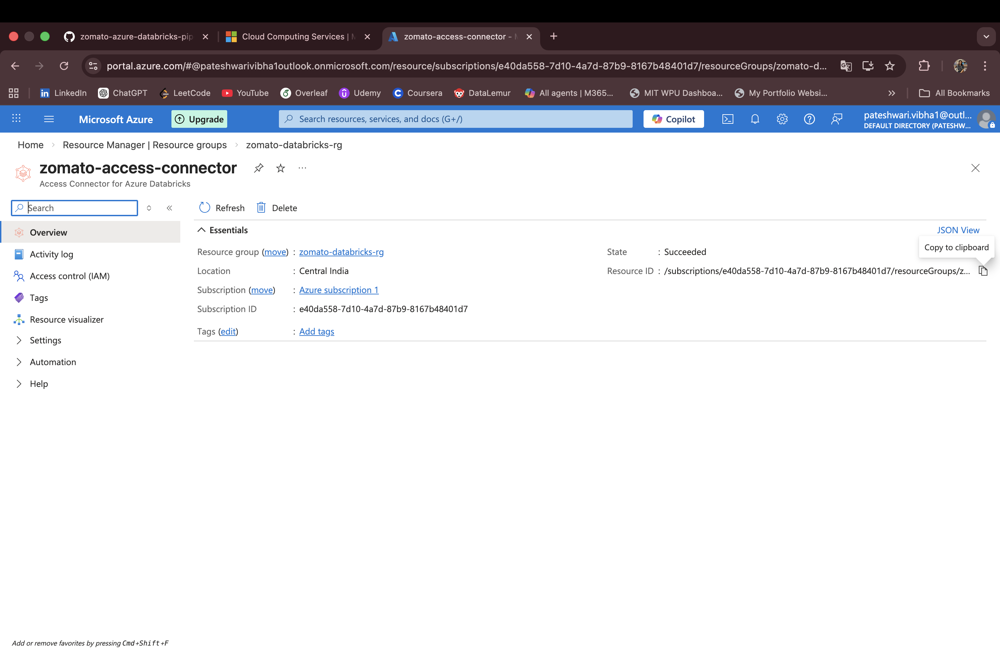
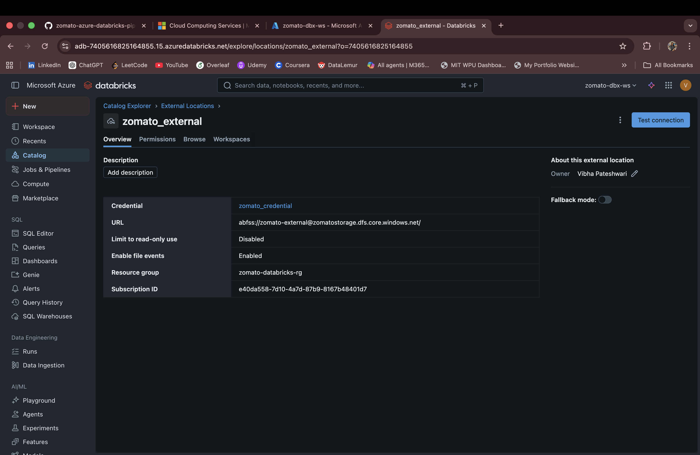
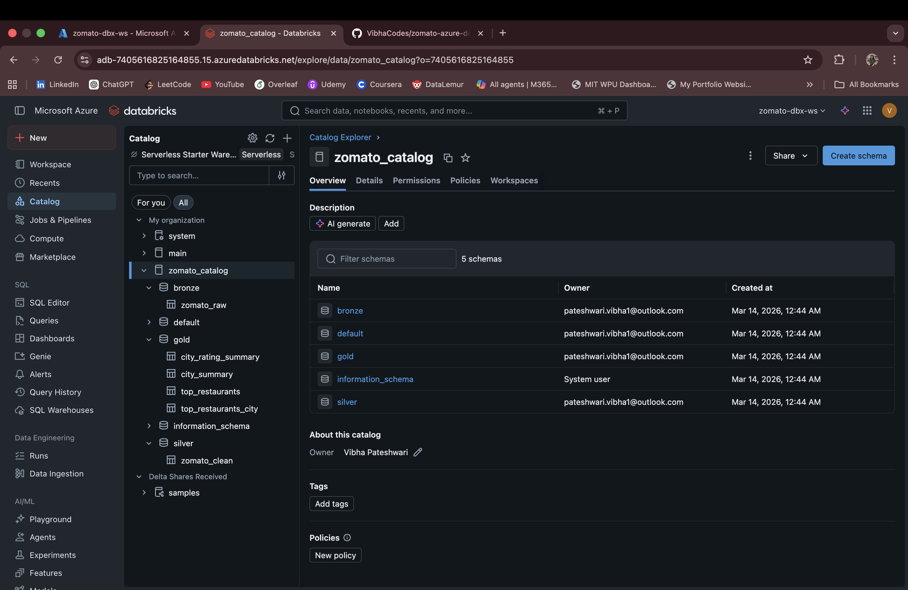
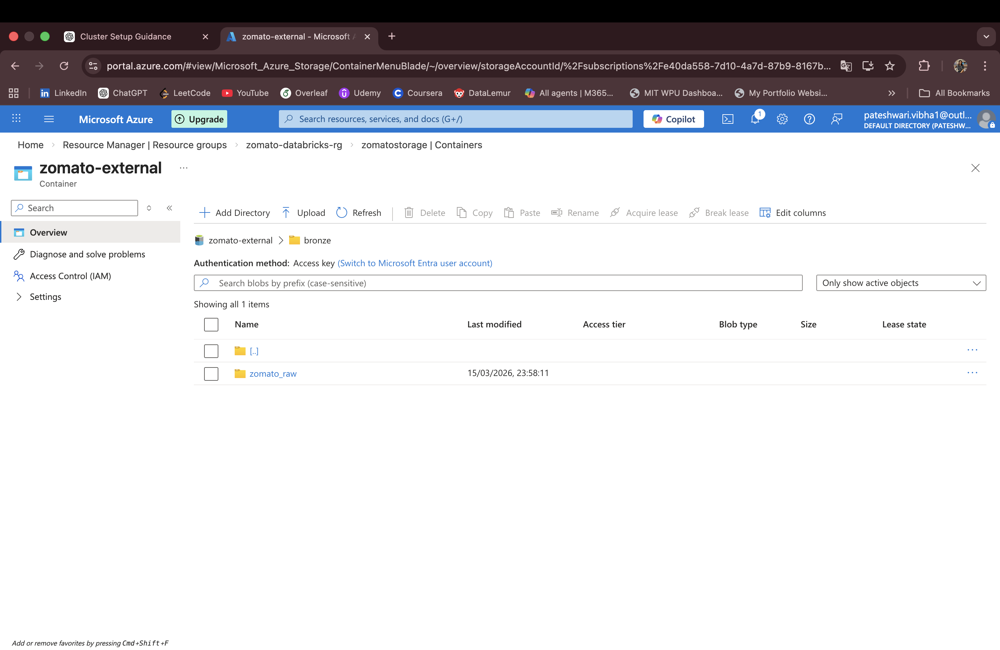

# zomato-azure-databricks-pipeline
End-to-End Data Engineering Project using Azure Data Lake, Databricks, and Medallion Architecture

# 🍽️ Zomato Data Engineering Pipeline using Azure & Databricks

## 📌 Project Overview

This project implements an **end-to-end data engineering pipeline** using **Azure Data Lake Storage and Databricks**.

The pipeline follows the **Medallion Architecture (Bronze, Silver, Gold layers)** to process and transform raw Zomato dataset into meaningful business insights.

---

## 🚀 Objectives

- Ingest raw data from Azure Storage
- Clean and transform the dataset
- Generate business insights using Spark
- Store data in Delta format
- Build a structured data pipeline

---

## 🛠️ Technologies Used

- Azure Resource Group
- Azure Data Lake Storage (ADLS Gen2)
- Azure Databricks
- Apache Spark (PySpark)
- Unity Catalog
- Delta Lake
- GitHub

---

## 🏗️ Architecture
Azure Resource Group  
        ↓  
Storage Account (ADLS Gen2)  
        ↓  
Container (zomato-external)  
        ↓  
Raw Data (CSV File)  
        ↓  
Bronze Layer (Raw Data Ingestion)  
        ↓  
Silver Layer (Data Cleaning & Transformation)  
        ↓  
Gold Layer (Business Analytics)  
        ↓  
Databricks (Apache Spark Processing)  
        ↓  
Unity Catalog (Table Management)  
        ↓  
Final Analytics Tables  

---

## 📂 Project Structure

zomato-azure-databricks-pipeline/

├── notebooks/
│   ├── 01_bronze_ingestion.py
│   ├── 02_silver_transformation.py
│   ├── 03_gold_analytics.py
│   └── 04_business_insights.py

├── screenshots/
│   ├── 01_resource_group.png
│   ├── 02_storage_account.png
│   ├── 03_container.png
│   ├── 04_folders_structure.png
│   ├── 05_databricks_workspace.png
│   ├── 06_cluster.png
│   ├── 07_access_connector.png
│   ├── 08_external_location.png
│   ├── 09_unity_catalog.png
│   ├── 10_bronze.png
│   ├── 11_silver.png
│   ├── 12_gold.png
│   └── 13_pipeline.png

---

## 🔄 Pipeline Flow

### 1️⃣ Data Ingestion (Bronze Layer)
- Raw CSV file is stored in Azure Storage (`raw` folder)
- Data is read using Spark and stored in Delta format
- Saved in Bronze layer

### 2️⃣ Data Cleaning (Silver Layer)
- Remove duplicates
- Remove null values
- Clean invalid ratings
- Convert data types (e.g., rating → double)

### 3️⃣ Data Transformation (Gold Layer)
- Perform aggregations
- Calculate average ratings
- Generate business insights
- Store results in Gold layer

---

## 📊 Key Features

- End-to-end data pipeline
- Implementation of Medallion Architecture
- Use of Delta Lake for optimized storage
- Spark-based data processing
- Integration with Unity Catalog
- Automated pipeline using Databricks Jobs

---

## 🔐 Data Governance (Unity Catalog)

- Used Access Connector to securely connect Databricks with Azure Storage
- Created External Location to access ADLS data
- Managed data using Unity Catalog (bronze, silver, gold layers)

---

## 📈 Business Insights Generated

- Top restaurants based on ratings
- City-wise restaurant count
- Average dining rating per city
- Average price per city

---

## 📸 Screenshots

### Azure Setup

### Databricks Setup

### Data Governance

### Data Pipeline

### Pipeline Execution

## 🎯 Conclusion

This project demonstrates how to build a **real-world data engineering pipeline** using cloud technologies.

It showcases:
- Data ingestion
- Data transformation
- Data modeling
- Analytics generation

---

## 👩‍💻 Author

**Vibha Pateshwari**

---
